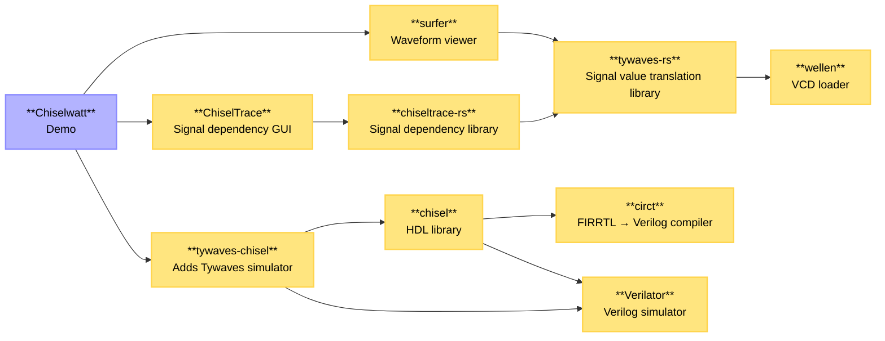

# High level Chisel debugging

When you want to test if a circuit functions as intended, you run simulations of the circuit. You apply values to the inputs, wait for the required time (in cycles), and then check if the output signals contain the expected values. Apart from testing the values in code, the waveform viewer is usually your best friend as a hardware designer. The Surfer waveform viewer is a modern, cross platform application that we will use in our experiments.

When simulating circuits with Chisel and ChiselTrace, the waveform file is dumped in `test_run_dir/ComponentName/ChiselTraceDebugger/defaultSimulation/trace.vcd`, where `CompentName` will be the name of the top level component that you are simulating.

The first step will be to open the waveform in Surfer, without special Tywaves handling. In the `vcd` file, the component (called `dut`) is wrapped in the scopes `TOP` and `svsimTestbench`. The top level component does not retain its name here, it gets set to `dut` (after device under test), but any nested components do. By selecting this component or its nested components, you can add the signals (called variables in Surfer) to the waveform by clicking on them.

In the bare `vcd` display, by default, any signal that contains more than 1 bit gets displayed in hexadecimal format. You can select the signals in the waveform panel, right click, and set the format to unsigned, signed, binary, etc. Compound signals such as bundles or vectors get split up in different signals for each leaf during compilation. They are recognisable by the `_` characters in the signal name.

With [Tywaves](https://github.com/rameloni/tywaves-chisel) enabled, the additional metadata generated during compilation is used to improve the situation. The signal display type gets set automatically. Compound signals get reconstructed and can be added to the waveform in one go, displayed as collapsible tree structures, instead of needing to add all leaf signals individually.

If a problem is detected, either manually or by a failed assertion, [ChiselTrace](https://github.com/jarlb/chiseltrace) can be used to find out where an erroneous value comes from. It uses the same metadata as Tywaves, in combination with extra metadata about which signals are used in assignments and conditionals. When the ChiselTrace application launches, you are presented with a graph that starts from the criterion node that was specified (in the command, or automatically by the ChiselTrace debugger at an assertion error). The graph flows from left (end of simulation) to right (`t=0`). A line from a node/vertice `A` to another node/vertice `B` indicates that signal `A` depends on signal `B`.

> The window can be scrolled sideways. If scrolling does not work for some reason, try holding the `shift` button while scrolling.
> 

Different parts of the graph are styled differently to convey what they indicate. The legend is as follows:

- Blue elliptical node/vertice: a normal signal, e.g. `val mySignal = Wire(Uint(8.W))`
- Green rectangular node/vertice: an IO input signal, e.g. `val myInput = IO(Input(Uint(8.W)))`
- Blue line/edge: a standard dependency, e.g. `mySignal := myInput`
- Purple line/edge: an indexing dependency, e.g. `myOutput := someMemory(readAddress)`
- Red diamond node/vertice and line/edge: a conditional/control flow dependency and its expression, e.g. `when(myInput) { ... }`

When a node is hovered, it shows the related line in the Chisel source code of the circuit and the incoming and outgoing dependency edges. Nodes can be dragged around to improve the overview of the relationships. You can right click a node to make that node the new criterion and hide any dependent nodes after it. This can be reset by right clicking the background and selecting “Reset graph”.

> Note that the button “Show in VS Code” does not work, as VS Code is not installed within the container.
> 

## Demo circuits

The repository contains various example circuits taken from the examples folder of the [Tywaves-Chisel](https://github.com/jarlb/tywaves-chisel) repository. See the main readme for details on how to execute them.

## ChiselWatt

The docker container image contains a prepared clone of our group’s fork of the ChiselWatt open source POWER ISA processor ([see repository](https://github.com/jarlb/chiselwatt/)). This clone, and thus the code, lives in `/usr/src/chiselwatt` within the container. In that directory you can run the following command to execute the simulation of the ChiselWatt core with a simple program. Execution, after downloading dependencies and compiling scala code, is around a minute.

```bash
sbt "testOnly *CoreTest"
```

The Scala unit test code corresponding to this test is the file `/usr/src/chiselwatt/src/test/scala/Core.scala`. The fault in the code will result in an assertion error getting triggered: `Assertion failed. Context: Expectation failed: observed value 9 != 8` through the line `c.io.adderOut.expect(8.U)`. Because of this the CLI prompts you asking to launch ChiselTrace to find the fault. You may need to scroll up to see it, as the logging from the Surfer waveform viewer starting after the simulation occludes it.

Once you confirm starting the dependency tracing analysis by typing `dt` (for “dynamic trace”), you will be presented with the waveform and the ChiselTrace program. The signal node that forms the start of the trace is `connect_io.adderOut`, connecting with value `9` to `connect_io.out`.

From this point, try to find where the fault originates from. You can right click on nodes to make them the new head. This will hide all dependency paths before that node. This can be undone with right clicking and selecting *reset graph*.

> Note that the button “Show in VS Code” does not work, as VS Code is not installed within the container.
> 

The code that gets executed on the core is as follows:

```nasm
.section ".text"
.global main

main:
    ; Set up test values
    li      3, 0b0101
    li      4, 0b0011

    ; THE FAULTY INSTRUCTION (should XOR but does OR)
    xor     5, 3, 4    ; Expected: 0b0110 (6)

    addi    6, 5, 2    ; Expected: 6+2=8

    ; Freeze state for inspection
    blr
```

Written in a more abstracted way, it does the following:

```nasm
R3 = 5
R4 = 3
R5 = R3 ^ R4 ; 5 ^ 3 = 0b0101 ^ 0b0011 = 0b0110 = 6
R6 = R5 + 2  ; 6 + 2 = 8 -> the expected value at c.io.adderOut
```

The system comprises of a lot of different software components. They are related like this:

