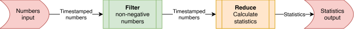

# Tydi

Material for experimenting with Tydi is given in this markdown file and in the tydi-material folder.

## Visualizer application

Access the Tydi visualizer application at [https://abs-tudelft.github.io/tydi-stream-vis/](https://abs-tudelft.github.io/tydi-stream-vis/).

It is meant to be used in the following way:

1. Insert `json` data containing an example of what you want to transfer in your hardware design
2. The data's data schema is extracted
3. A Tydi structure is created in the [Blockly](https://www.blockly.com/) canvas based on this data schema
    - Each element is given a path mapping to the original data
    - Nullable elements are converted to `Union`s
4. Each stream in the schema (corresponding to a sequence) is split into a separate *physical stream* and data packets are constructed based on the input data
5. Stream transfers are visualized using these data packets

To facilitate this, the app has several tabs:

- Data import: paste JSON content here
- Code generator: shows code for Tydi-lang, Chisel, and Clash to create the actual hardware design for the Tydi structure
- Tydi structure builder: the Blockly canvas that visually shows, and allows editing, the Tydi structure
- Stream visualizer: shows all physical streams of the Tydi hierarchy, together with a table of the transfers and their elements based on the JSON input data
- Packet inspector: when a packet is clicked in the stream visualizer, this panel shows more detailed information about the stream and the specific packet. This includes the dimensionality information, indexes in the source sequences, packet content, and the binary data packing.

## Pipeline example

This example comes from the original [Tydi-Chisel library](https://github.com/abs-tudelft/tydi-chisel) and the conference and journal publications. The idea is that we create a simple streaming pipeline that transforms some data. Specifically, we take in a *stream of numbers with timestamps attached*. This stream first gets filtered on $value\geq0$ and then reduced to statistics: min value, max value, sum of values, and average. The block schedule for this system is as follows:



### **Tydi-lang**

The example starts with a description of the streams and streamlets in Tydi-lang.

```jsx
#### package pack0;
UInt_64_t = Bit(64); // UInt<64>
SInt_64_t = Bit(64); // SInt<64>

Group NumberGroup {
    value: SInt_64_t;
    time: UInt_64_t;
}

Group Stats {
    average: UInt_64_t;
    sum: UInt_64_t;
    max: UInt_64_t;
    min: UInt_64_t;
}

NumberGroup_stream = Stream(NumberGroup, t=1.0, d=1, c=1);
Stats_stream = Stream(Stats, t=1.0, d=1, c=1);

#### package pack1;
use pack0;

streamlet NumsFilter_interface {
    std_out : pack0.NumberGroup_stream out;
    std_in : pack0.NumberGroup_stream in;
}

impl NonNegativeFilter of NumsFilter_interface {}

streamlet NumsToStats_interface {
    std_out : pack0.Stats_stream out;
    std_in : pack0.NumberGroup_stream in;
}

impl Reducer of NumsToStats_interface {}

impl PipelineExample of NumsToStats_interface {
    instance filter(NonNegativeFilter);
    instance reducer(Reducer);
    filter.std_out => reducer.std_in;
    reducer.std_out => self.std_out;
    self.std_in => filter.std_in;
}
```

### **Tydi type**

The Tydi type that corresponds to the number stream is as follows:

$Stream(t=Group(Bits(64), Bits(64)), d=1)$

Or, expressed in the syntax of the Tydi formalism: $Dim(Group(Bits(64), Bits(64)))$

### **Data**

Some example data can be generated with the following JavaScript method. Below this block is some pre-generated data.

```jsx
function generateDataWithStats(count = 20) {
  const input = [];
  
  // 1. Generate random input data
  for (let i = 1; i <= count; i++) {
    const randomValue = Math.floor(Math.random() * 101) - 50; 
    input.push({
      value: randomValue,
      time: i
    });
  }

  // 2. Filter for values >= 0
  const validValues = input
    .map(item => item.value)
    .filter(val => val >= 0);

  // 3. Calculate statistics with specific edge cases
  if (validValues.length === 0) {
    return {
      input,
      output: {
        average: 0,
        sum: 0,
        max: 0,
        min: Number.MAX_SAFE_INTEGER // 9007199254740991
      }
    };
  }

  const sum = validValues.reduce((acc, curr) => acc + curr, 0);
  
  return {
    input,
    output: {
      average: Math.floor(sum / validValues.length), // Integer division (floor)
      sum: sum,
      max: Math.max(...validValues),
      min: Math.min(...validValues)
    }
  };
}

console.log(JSON.stringify(generateDataWithStats(20)));
```

A few runs of this produces:

```jsx
{
  "input": [{"value":-22,"time":1},{"value":31,"time":2},{"value":-35,"time":3},{"value":-40,"time":4},{"value":23,"time":5},{"value":10,"time":6},{"value":-3,"time":7},{"value":39,"time":8},{"value":15,"time":9},{"value":40,"time":10},{"value":-44,"time":11},{"value":-15,"time":12},{"value":31,"time":13},{"value":-45,"time":14},{"value":-37,"time":15},{"value":-35,"time":16},{"value":-40,"time":17},{"value":38,"time":18},{"value":-32,"time":19},{"value":-31,"time":20}],
  "output": {"average":28,"sum":227,"max":40,"min":10}
}
{
  "input": [{"value":-8,"time":1},{"value":17,"time":2},{"value":-39,"time":3},{"value":-40,"time":4},{"value":6,"time":5},{"value":5,"time":6},{"value":-41,"time":7},{"value":-6,"time":8},{"value":37,"time":9},{"value":1,"time":10}],
  "output": {"average":13,"sum":66,"max":37,"min":1}
}
{
  "input": [{"value":20,"time":1},{"value":30,"time":2},{"value":40,"time":3},{"value":-36,"time":4},{"value":-37,"time":5},{"value":21,"time":6},{"value":44,"time":7},{"value":31,"time":8},{"value":27,"time":9},{"value":-34,"time":10},{"value":28,"time":11},{"value":30,"time":12},{"value":-1,"time":13},{"value":17,"time":14},{"value":-26,"time":15}],
  "output":{"average":28,"sum":288,"max":44,"min":17}
}
```

Transforming this into lists of intputs and outputs gives the following arrays:

**Inputs**

```js
[
  [{"value":-22,"time":1},{"value":31,"time":2},{"value":-35,"time":3},{"value":-40,"time":4},{"value":23,"time":5},{"value":10,"time":6},{"value":-3,"time":7},{"value":39,"time":8},{"value":15,"time":9},{"value":40,"time":10},{"value":-44,"time":11},{"value":-15,"time":12},{"value":31,"time":13},{"value":-45,"time":14},{"value":-37,"time":15},{"value":-35,"time":16},{"value":-40,"time":17},{"value":38,"time":18},{"value":-32,"time":19},{"value":-31,"time":20}],
  [{"value":-8,"time":1},{"value":17,"time":2},{"value":-39,"time":3},{"value":-40,"time":4},{"value":6,"time":5},{"value":5,"time":6},{"value":-41,"time":7},{"value":-6,"time":8},{"value":37,"time":9},{"value":1,"time":10}],
  [{"value":20,"time":1},{"value":30,"time":2},{"value":40,"time":3},{"value":-36,"time":4},{"value":-37,"time":5},{"value":21,"time":6},{"value":44,"time":7},{"value":31,"time":8},{"value":27,"time":9},{"value":-34,"time":10},{"value":28,"time":11},{"value":30,"time":12},{"value":-1,"time":13},{"value":17,"time":14},{"value":-26,"time":15}]
]
```

**Outputs**
```js
[
  {"average":28,"sum":227,"max":40,"min":10},
  {"average":13,"sum":66,"max":37,"min":1},
  {"average":28,"sum":288,"max":44,"min":17}
]
```

These can be inserted in separate instances of the visualizer. For the input, the number of lanes (`n`) should be a bit higher, so there is more overview.

#### Exercises

Insert the outputs and inputs into separate instances of the visualizer and analyse the structure and packets.

### **Chisel**

When the Tydi-lang code is transpiled to Chisel code, the following is obtained.

```scala
// Based on transpile output

/** Implementation, defined in pack1. */
class NonNegativeFilter extends NonNegativeFilter_interface {
	outStream := inStream
  outStream.strb := inStream.strb(0) && inStream.el.value >= 0.S
}

/** Implementation, defined in pack1. */
class PipelineExample extends PipelineExample_interface {
    // Modules
    val filter = Module(new NonNegativeFilter)
    val reducer = Module(new Reducer)

    // Connections
    reducer.in := filter.out
    out := reducer.out
    filter.in := in
}

```

A more compact version can be obtained when utility classes are used.

```scala
// Using utility classes

/** A module based on a stream-processing base with input and output streams of type `NumberGroup`.
  * Input and output streams are passthrough-connected by default so only meaningful signals are overridden.
  */
class NonNegativeFilter extends SubProcessorBase(new NumberGroup, new NumberGroup) {
  outStream.strb := inStream.strb(0) && inStream.el.value >= 0.S
}

/** Using the stream processing modules with chaining syntax.
  * SimpleProcessorBase is similar to SubProcessorBase but
  * does not expose the detailed Stream content signals. */
class PipelineExampleModule extends SimpleProcessorBase(new NumberGroup, new Stats) {
  out := in.processWith(new NonNegativeFilter).processWith(new Reducer())
}
```

## Student data analysis

A more advanced example is a dataset of students and their exam results. This example also comes from the original [Tydi-Chisel library](https://github.com/abs-tudelft/tydi-chisel) and the journal publication. A lot of streams are involved, because the data contains a lot of strings, and each string is a sequence of unknown runtime length.

### **JSON data**

The data looks like this

```json
[
  {
    "student_number": "S123456789",
    "name": "John Doe",
    "birthdate": "2000-05-15",
    "study_start": "2021-05-15",
    "study_end": null,
    "study": "Computer Science",
    "email": "john.doe@example.com",
    "exams": [
      {
        "course_code": "CS101",
        "course_name": "Introduction to Computer Science",
        "exam_date": "2023-12-10",
        "grade": 80
      },
      {
        "course_code": "MATH201",
        "course_name": "Calculus",
        "exam_date": "2023-12-15",
        "grade": 60
      }
    ]
  },
  {
    "student_number": "S234567890",
    "name": "Jane Smith",
    "birthdate": "2002-08-20",
    "study_start": "2020-09-01",
    "study_end": null,
    "study": "Computer Science",
    "email": "jane.smith@example.com",
    "exams": [
      {
        "course_code": "CS302",
        "course_name": "Data Structures and Algorithms",
        "exam_date": "2024-02-22",
        "grade": 85
      },
      {
        "course_code": "ELEC301",
        "course_name": "Computer Networks",
        "exam_date": "2023-11-17",
        "grade": 75
      }
    ]
  },
  {
    "student_number": "S345678901",
    "name": "Bob Johnson",
    "birthdate": "1998-03-12",
    "study_start": "2019-01-15",
    "study_end": null,
    "study": "Computer Science",
    "email": "bob.johnson@example.com",
    "exams": [
      {
        "course_code": "CS203",
        "course_name": "Operating Systems",
        "exam_date": "2023-05-19",
        "grade": 90
      },
      {
        "course_code": "INFO201",
        "course_name": "Database Management Systems",
        "exam_date": "2024-03-25",
        "grade": 80
      }
    ]
  },
  {
    "student_number": "S456789012",
    "name": "Emily Chen",
    "birthdate": "2005-10-28",
    "study_start": "2018-09-01",
    "study_end": null,
    "study": "Computer Science",
    "email": "emily.chen@example.com",
    "exams": [
      {
        "course_code": "CS404",
        "course_name": "Artificial Intelligence and Machine Learning",
        "exam_date": "2023-12-01",
        "grade": 95
      },
      {
        "course_code": "STAT301",
        "course_name": "Data Mining",
        "exam_date": "2024-02-15",
        "grade": 85
      }
    ]
  },
  {
    "student_number": "S567890123",
    "name": "Michael Lee",
    "birthdate": "1995-06-22",
    "study_start": "2017-01-16",
    "study_end": null,
    "study": "Computer Science",
    "email": "michael.lee@example.com",
    "exams": [
      {
        "course_code": "CS301",
        "course_name": "Programming Languages and Paradigms",
        "exam_date": "2023-04-14",
        "grade": 88
      },
      {
        "course_code": "GAME201",
        "course_name": "Game Development with Python",
        "exam_date": "2024-01-18",
        "grade": 92
      }
    ]
  },
  {
    "student_number": "S678901234",
    "name": "Sarah Kim",
    "birthdate": "2001-02-14",
    "study_start": "2016-09-15",
    "study_end": null,
    "study": "Computer Science",
    "email": "sarah.kim@example.com",
    "exams": [
      {
        "course_code": "CS402",
        "course_name": "Web Development with JavaScript and HTML/CSS",
        "exam_date": "2023-11-10",
        "grade": 95
      },
      {
        "course_code": "INFO302",
        "course_name": "Human-Computer Interaction Design Principles",
        "exam_date": "2024-03-01",
        "grade": 90
      }
    ]
  },
  {
    "student_number": "S789012345",
    "name": "David Patel",
    "birthdate": "1992-04-18",
    "study_start": "2015-08-15",
    "study_end": null,
    "study": "Computer Science",
    "email": "david.patel@example.com",
    "exams": [
      {
        "course_code": "CS501",
        "course_name": "Compilers and Interpreters",
        "exam_date": "2023-03-17",
        "grade": 92
      },
      {
        "course_code": "ELEC401",
        "course_name": "Computer Architecture",
        "exam_date": "2024-02-01",
        "grade": 88
      }
    ]
  },
  {
    "student_number": "S890123456",
    "name": "Olivia Brown",
    "birthdate": "2003-11-25",
    "study_start": "2019-09-15",
    "study_end": null,
    "study": "Computer Science",
    "email": "olivia.brown@example.com",
    "exams": [
      {
        "course_code": "CS302",
        "course_name": "Data Structures and Algorithms",
        "exam_date": "2023-12-15",
        "grade": 85
      },
      {
        "course_code": "INFO201",
        "course_name": "Database Management Systems",
        "exam_date": "2024-03-22",
        "grade": 80
      }
    ]
  },
  {
    "student_number": "S901234567",
    "name": "Alexander White",
    "birthdate": "1990-01-05",
    "study_start": "2018-08-15",
    "study_end": null,
    "study": "Computer Science",
    "email": "alexander.white@example.com",
    "exams": [
      {
        "course_code": "CS401",
        "course_name": "Network Security and Cryptography",
        "exam_date": "2023-11-17",
        "grade": 95
      },
      {
        "course_code": "GAME302",
        "course_name": "Game Development with C++",
        "exam_date": "2024-02-15",
        "grade": 90
      }
    ]
  }
]
```

It should be noted that this example does not give the most interesting streaming type, as nesting depth is limited of both the groups and the streams. The most interesting data is probably the strings within the exams info, because they are 3rd dimension data, resulting in more complex relationships between an element and its role in the ending of sequences.

## Chats with messages example

An example that shows various interesting aspects of Tydi’s typing and protocol is a list of chats that each contain messages with some metadata and text that is split up in words. This means that the characters in the messages are 4-dimensional data elements (chats→messages→words→characters). The first and second dimension elements carry some metadata about respectively the chats and the messages.

### **JSON**

```json
[
  {
    "chat_id": 102938475612345678,
    "messages": [
      {
        "timestamp": 1712052000,
        "message_id": 9001,
        "user_id": 1001,
        "words": ["Shall", "we", "order", "pizza", "tonight?"]
      },
      {
        "timestamp": 1712052060,
        "message_id": 9002,
        "user_id": 1002,
        "words": ["Sure,", "I", "would", "love", "some", "Pepperoni."]
      },
      {
        "timestamp": 1712052120,
        "message_id": 9003,
        "user_id": 1001,
        "words": ["Great,", "I", "will", "place", "the", "order", "now."]
      },
      {
        "timestamp": 1712052180,
        "message_id": 9004,
        "user_id": 1002,
        "words": ["Don't", "forget", "the", "garlic", "dipping", "sauce!"]
      }
    ]
  },
  {
    "chat_id": 223344556677889900,
    "messages": [
      {
        "timestamp": 1712138400,
        "message_id": 12050,
        "user_id": 2005,
        "words": ["Did", "you", "see", "the", "latest", "rocket", "launch?"]
      },
      {
        "timestamp": 1712138520,
        "message_id": 12051,
        "user_id": 2006,
        "words": ["The", "booster", "landing", "was", "incredible."]
      },
      {
        "timestamp": 1712138600,
        "message_id": 12052,
        "user_id": 2005,
        "words": ["It", "still", "feels", "like", "science", "fiction."]
      },
      {
        "timestamp": 1712138700,
        "message_id": 12053,
        "user_id": 2006,
        "words": ["True,", "the", "reusability", "is", "a", "game", "changer."]
      }
    ]
  },
  {
    "chat_id": 556677889900112233,
    "messages": [
      {
        "timestamp": 1712224800,
        "message_id": 33001,
        "user_id": 3001,
        "words": ["Is", "the", "deployment", "to", "production", "finished?"]
      },
      {
        "timestamp": 1712224900,
        "message_id": 33002,
        "user_id": 3002,
        "words": ["Yes,", "all", "unit", "tests", "passed", "successfully."]
      },
      {
        "timestamp": 1712224950,
        "message_id": 33003,
        "user_id": 3001,
        "words": ["Great", "job", "team!"]
      },
      {
        "timestamp": 1712225000,
        "message_id": 33004,
        "user_id": 3003,
        "words": ["I", "am", "monitoring", "the", "logs", "now."]
      },
      {
        "timestamp": 1712225100,
        "message_id": 33005,
        "user_id": 3003,
        "words": ["Everything", "looks", "stable", "so", "far."]
      }
    ]
  },
  {
    "chat_id": 998877665544332211,
    "messages": [
      {
        "timestamp": 1712311200,
        "message_id": 55010,
        "user_id": 4001,
        "words": ["I", "started", "reading", "that", "new", "fantasy", "novel."]
      },
      {
        "timestamp": 1712311300,
        "message_id": 55011,
        "user_id": 4002,
        "words": ["The", "world-building", "is", "absolutely", "stunning."]
      },
      {
        "timestamp": 1712311400,
        "message_id": 55012,
        "user_id": 4001,
        "words": ["Wait", "until", "you", "get", "to", "chapter", "five."]
      },
      {
        "timestamp": 1712311500,
        "message_id": 55013,
        "user_id": 4002,
        "words": ["No", "spoilers", "please!", "I", "am", "only", "on", "page", "ten."]
      }
    ]
  }
]
```

### Exercises

- Click on various elements in the **Tydi structure builder** or **stream visualizer** tab. Check out which elements they correspond to in the other tabs, such as the input data, or the Tydi structure (when clicking in the visualizer).
- Inspect the data packing of the message data. Change the bit widths in the block editor.
- Change the number of lanes of some streams.
- Inspect the dimensionality (`last` flags) information of the message text. Different sequence endings have different colours.
